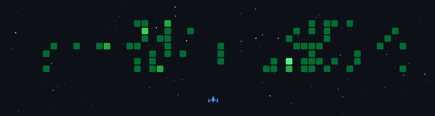

  
  <!-- Clean Header -->
  <h1>
    
  </h1>
  
  <!-- Professional Summary -->
  
<em>Computer Science Engineer | Problem Solver | Code Enthusiast</em>

  
  <!-- Key Stats -->
  

    
    
    
  

  

---

## 👨‍💻 About Me

**Hi, I'm Harsh Pipaliya** - a passionate Computer Science Engineer from India specializing in full-stack development and competitive programming.

### 🚀 What I Do:
- Building scalable web applications with modern JavaScript frameworks
- Solving algorithmic challenges on competitive programming platforms
- Contributing to open-source projects and learning new technologies

### 🎯 Current Focus:
- Mastering **React.js**, **Node.js**, and **Python**
- Advancing in **Data Structures & Algorithms**
- System design and scalable architecture patterns

### 💡 Philosophy:
*"Quality code isn't just about working solutions—it's about creating maintainable, efficient systems that solve real problems."*

---

## 🛠️ Technology Stack

<table>
<tr>
<td align="center" width="50%">

**Languages**

</td>
<td align="center" width="50%">

**Frontend**

</td>
</tr>
<tr>
<td align="center">

**Backend & Database**

</td>
<td align="center">

**Tools & DevOps**

</td>
</tr>
</table>

---

## 🏆 Competitive Programming

  
  
  
    
  
  

    
    
    
    
  

  

---

## 📊 GitHub Analytics

  
  
  
  
  
  
  
    
  
  
  

---

## 🎮 Contribution Games

### 🐍 Snake Animation
<picture>
  <source media="(prefers-color-scheme: dark)" srcset="https://raw.githubusercontent.com/hp-078/hp-078/output/github-contribution-grid-snake-dark.svg">
  <source media="(prefers-color-scheme: light)" srcset="https://raw.githubusercontent.com/hp-078/hp-078/output/github-contribution-grid-snake.svg">
  
</picture>

  

### 🚀 Space Shooter

<em>An interactive space shooter generated from my GitHub activity</em>

---

## 📫 Connect With Me

  
  <h3>💼 Professional</h3>
  

    
    
    
  

  
  <h3>🏆 Competitive Coding</h3>
  

    
    
    
    
  

  

---

  
  
  
  **Thanks for visiting! ⭐**
  
  *Show some ❤️ by starring interesting repositories!*
  
  
  

